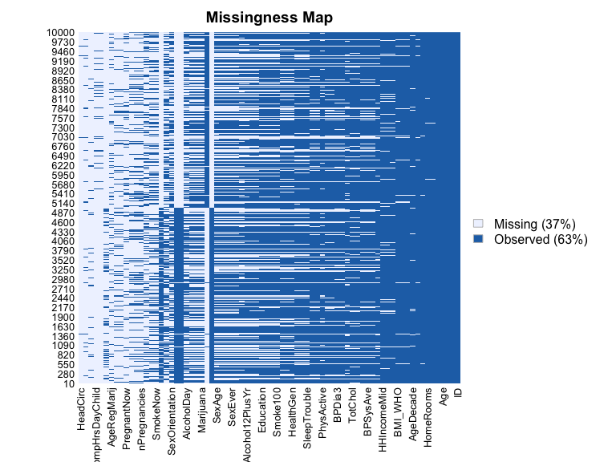
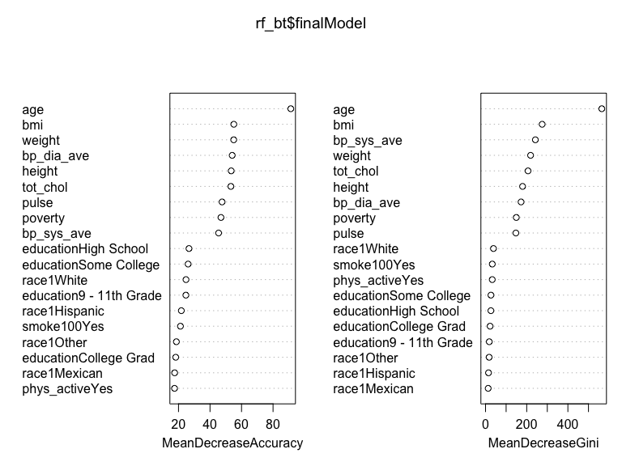
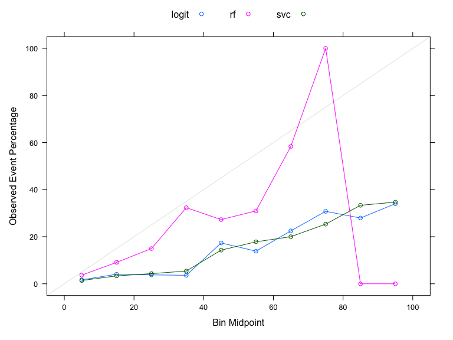
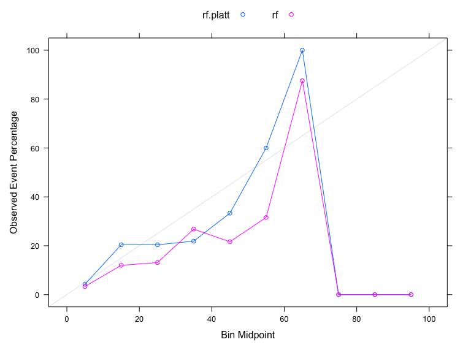
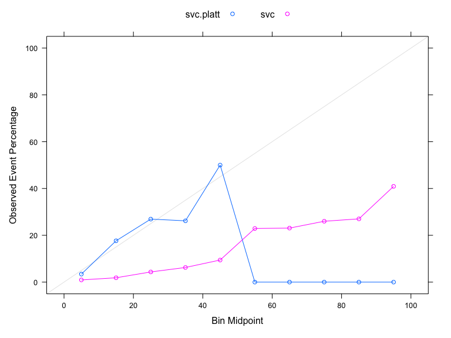

ml_hw9
================
Mohammad
2023-03-27

## Goal: use three different algorithms (random forest, SVC and logistic regression) to generate a clinical risk score for diabetes, then compare the three models.

### Data Processing

The code below to load and subset the data and remove missing
observations.

``` r
set.seed(123)

data(NHANES)

#Check missingness in the data
Amelia::missmap(NHANES)
```



``` r
nhanes <-
    NHANES %>% 
    as_tibble(NHANES) %>% 
    select(Age, Race1, Education, Poverty, Weight, Height, Pulse, Diabetes, BMI, PhysActive, Smoke100, BPSysAve, BPDiaAve, TotChol) %>%
    janitor::clean_names() %>% 
    drop_na() %>% 
    distinct()

str(nhanes)
```

    ## tibble [3,880 × 14] (S3: tbl_df/tbl/data.frame)
    ##  $ age        : int [1:3880] 34 49 45 66 58 54 58 50 33 60 ...
    ##  $ race1      : Factor w/ 5 levels "Black","Hispanic",..: 4 4 4 4 4 4 3 4 4 4 ...
    ##  $ education  : Factor w/ 5 levels "8th Grade","9 - 11th Grade",..: 3 4 5 4 5 2 3 4 3 3 ...
    ##  $ poverty    : num [1:3880] 1.36 1.91 5 2.2 5 2.2 2.03 1.24 1.27 1.03 ...
    ##  $ weight     : num [1:3880] 87.4 86.7 75.7 68 78.4 74.7 57.5 84.1 93.8 74.6 ...
    ##  $ height     : num [1:3880] 165 168 167 170 182 ...
    ##  $ pulse      : int [1:3880] 70 86 62 60 62 76 94 74 96 84 ...
    ##  $ diabetes   : Factor w/ 2 levels "No","Yes": 1 1 1 1 1 1 1 1 1 1 ...
    ##  $ bmi        : num [1:3880] 32.2 30.6 27.2 23.7 23.7 ...
    ##  $ phys_active: Factor w/ 2 levels "No","Yes": 1 1 2 2 2 2 2 2 1 1 ...
    ##  $ smoke100   : Factor w/ 2 levels "No","Yes": 2 2 1 2 1 1 2 1 2 2 ...
    ##  $ bp_sys_ave : int [1:3880] 113 112 118 111 104 134 127 142 128 152 ...
    ##  $ bp_dia_ave : int [1:3880] 85 75 64 63 74 85 83 68 74 100 ...
    ##  $ tot_chol   : num [1:3880] 3.49 6.7 5.82 4.99 4.24 6.41 4.78 5.22 5.59 6.39 ...

``` r
summary(nhanes[, "diabetes"])
```

    ##  diabetes  
    ##  No :3437  
    ##  Yes: 443

### Partitioning data

Partition data into a 70/30 training/testing split.

``` r
set.seed(123)

train.index <- 
    nhanes$diabetes %>% 
    createDataPartition(p = 0.7, list = FALSE)

train_df <- 
    nhanes[train.index, ]

test_df <- 
    nhanes[-train.index, ]
```

### Models

Here we construct three models in the training set using each of the
three algorithms to predict diabetes. For the random forest, we try 3
different values of mtry. For SVC, vary the cost parameter using a
vector of values in a grid. We use up sampling for all three models.

### Model 1: Random Forest with 3 values of mtry and 3 values of ntree

``` r
# Try mtry of all, half of all, sqrt of all, 
# Try ntree of 100, 300, 500
mtry <- 
    c(ncol(train_df)-1, sqrt(ncol(train_df)-1), 0.5*ncol(train_df)-1)

mtrygrid <- 
    expand.grid(.mtry = round(mtry))

control <- 
    trainControl(method = "cv", number = 10, sampling = "up")

tree_num <- 
    seq(100,500, by = 200)

results_trees <- 
    list()

for (ntree in tree_num){
    set.seed(123)
    nrf <- 
        train(diabetes ~ ., data = train_df, method = "rf", trControl = control, metric = "Accuracy", tuneGrid = mtrygrid,
              importance = TRUE, ntree = ntree)
    index <- 
        toString(ntree)
    
    results_trees[[index]] <- 
        nrf$results
}

output <- 
    bind_rows(results_trees, .id = "ntrees")

best_tune <- 
    output[which.max(output[,"Accuracy"]), ]

best_tune$mtry
```

    ## [1] 4

``` r
results_trees
```

    ## $`100`
    ##   mtry  Accuracy     Kappa  AccuracySD    KappaSD
    ## 1    4 0.8822308 0.2018155 0.009860566 0.09889773
    ## 2    6 0.8789166 0.2143566 0.015879691 0.09688263
    ## 3   13 0.8693551 0.2174717 0.018426986 0.08851178
    ## 
    ## $`300`
    ##   mtry  Accuracy     Kappa AccuracySD    KappaSD
    ## 1    4 0.8840718 0.2128822 0.01392709 0.10100945
    ## 2    6 0.8811279 0.2229898 0.01474166 0.09654646
    ## 3   13 0.8693496 0.2153955 0.01495737 0.08781172
    ## 
    ## $`500`
    ##   mtry  Accuracy     Kappa AccuracySD    KappaSD
    ## 1    4 0.8825971 0.1997113 0.01375111 0.09427232
    ## 2    6 0.8818673 0.2174401 0.01593452 0.11629653
    ## 3   13 0.8711906 0.2264867 0.01572046 0.09032385

``` r
mtrygrid <- expand.grid(.mtry = best_tune$mtry)

set.seed(123)
    rf_bt <- 
        train(diabetes ~., data = train_df, method = "rf", trControl = control, metric = "Accuracy", tuneGrid = mtrygrid,
              importance = TRUE, ntree = as.numeric(best_tune$ntrees))

confusionMatrix(rf_bt)
```

    ## Cross-Validated (10 fold) Confusion Matrix 
    ## 
    ## (entries are percentual average cell counts across resamples)
    ##  
    ##           Reference
    ## Prediction   No  Yes
    ##        No  86.5  9.5
    ##        Yes  2.1  1.9
    ##                             
    ##  Accuracy (average) : 0.8841

``` r
varImp(rf_bt)
```

    ## rf variable importance
    ## 
    ##                         Importance
    ## age                        100.000
    ## tot_chol                    45.944
    ## bmi                         42.133
    ## weight                      38.705
    ## bp_dia_ave                  35.573
    ## height                      35.547
    ## bp_sys_ave                  32.401
    ## pulse                       28.165
    ## poverty                     26.979
    ## race1White                  16.411
    ## educationHigh School        10.713
    ## education9 - 11th Grade      9.193
    ## educationSome College        8.704
    ## race1Hispanic                4.896
    ## race1Mexican                 3.113
    ## smoke100Yes                  3.053
    ## race1Other                   2.031
    ## phys_activeYes               1.242
    ## educationCollege Grad        0.000

``` r
varImpPlot(rf_bt$finalModel)
```



Increasing the number of cross validations to 10 instead of 5 and using
up sampling instead of down improves accuracy to 0.88. The most
important variables were age, total cholesterol, and BMI respectively.

### Model 2: Support Vector Classifier

``` r
set.seed(123)

control <- 
    trainControl(method = "cv", number = 5, sampling = "up", classProbs = TRUE)

#Repeat expanding the grid search
set.seed(123)

nsvc <- train(diabetes ~ ., data = train_df, method = "svmLinear", trControl= control, preProcess = c("center", "scale"),
             probability = TRUE, tuneGrid = expand.grid(C = seq(0.0001,100, length = 10)))

nsvc$bestTune
```

    ##         C
    ## 4 33.3334

``` r
nsvc$results
```

    ##           C  Accuracy     Kappa  AccuracySD    KappaSD
    ## 1    0.0001 0.7504726 0.2726347 0.020967977 0.02508331
    ## 2   11.1112 0.7519303 0.3038273 0.009914273 0.02045453
    ## 3   22.2223 0.7500907 0.3002407 0.006220660 0.02273034
    ## 4   33.3334 0.7537760 0.3064334 0.013284874 0.02952343
    ## 5   44.4445 0.7438367 0.2892485 0.008212017 0.01689901
    ## 6   55.5556 0.7519303 0.3026514 0.009923693 0.03363297
    ## 7   66.6667 0.7511971 0.3005226 0.015074564 0.02156431
    ## 8   77.7778 0.7482511 0.2935487 0.004620121 0.01629018
    ## 9   88.8889 0.7515661 0.2988514 0.011146146 0.03616381
    ## 10 100.0000 0.7534077 0.3013072 0.009368784 0.01798691

``` r
confusionMatrix(nsvc)
```

    ## Cross-Validated (5 fold) Confusion Matrix 
    ## 
    ## (entries are percentual average cell counts across resamples)
    ##  
    ##           Reference
    ## Prediction   No  Yes
    ##        No  66.4  2.4
    ##        Yes 22.2  9.0
    ##                             
    ##  Accuracy (average) : 0.7538

Initially I used up sampling, increasing the number of cross validation
to 10 and the tuneGrid length to 50 took too long (more than 60 minutes
and was still running). I reduced the tuneGrid length to 20 but the
issue persisted. I then reduced the number of cross validations to 5 and
the tuneGrid to 10. It still took 45+ minutes for my laptop to execute
it but it eventually worked. The resulting accuracy was 0.75

### Model 3: Logistic Regression

``` r
set.seed(123)

control <- 
    trainControl(method = "cv", number = 10, sampling = "up")

nlogit <-
    train(diabetes~., data = train_df, method = "glm", family = "binomial", preProcess = c("center", "scale"),
          trControl = control)

nlogit$results
```

    ##   parameter  Accuracy     Kappa AccuracySD    KappaSD
    ## 1      none 0.7486298 0.2980781 0.02392869 0.03546849

``` r
confusionMatrix(nlogit)
```

    ## Cross-Validated (10 fold) Confusion Matrix 
    ## 
    ## (entries are percentual average cell counts across resamples)
    ##  
    ##           Reference
    ## Prediction   No  Yes
    ##        No  65.9  2.5
    ##        Yes 22.6  8.9
    ##                             
    ##  Accuracy (average) : 0.7486

``` r
coef(nlogit$finalModel)
```

    ##               (Intercept)                       age             race1Hispanic 
    ##               -0.04350520                1.31349538                0.02086556 
    ##              race1Mexican                race1White                race1Other 
    ##                0.05551193               -0.26939327                0.24446686 
    ## `education9 - 11th Grade`    `educationHigh School`   `educationSome College` 
    ##               -0.17335794               -0.16244844               -0.03506694 
    ##   `educationCollege Grad`                   poverty                    weight 
    ##               -0.13087396               -0.14040898               -1.53316087 
    ##                    height                     pulse                       bmi 
    ##                0.80836958                0.26293717                2.14713855 
    ##            phys_activeYes               smoke100Yes                bp_sys_ave 
    ##                0.03546320                0.26374878                0.16989078 
    ##                bp_dia_ave                  tot_chol 
    ##                0.01924155               -0.22818866

Using up sampling and 10 fold cross validation in a logistic regression
model resulted in an accuracy of 0.75. The most important variables were
age, total cholesterol, and BMI respectively.

### Output predicted probabilities from each of the three models applied within the testing set.

``` r
#Predict in test-set and output probabilities
rf_probs <-
    predict(nrf, test_df, type = "prob")

#Pull out predicted probabilities for Diabetes=Yes
rf_pp <-
    rf_probs[,2]

svc_probs <-
    predict(nsvc, test_df, type = "prob")

svc_pp <- 
    svc_probs[,2]

#Predict in test-set using response type
logit_probs <-
    predict(nlogit, test_df, type = "prob")

logit_pp <- logit_probs[,2]
```

### Plot and compare calibration curves across the three algorithms.

``` r
pred_prob <- 
    data.frame(Class = test_df$diabetes, logit = logit_pp, rf = rf_pp, svc = svc_pp)

calplot <- 
    (calibration(Class ~ logit + rf + svc, data = pred_prob, class = "Yes", cuts = 10))

xyplot(calplot, auto.key = list(columns = 3))
```



### Calibrate the probabilities from SVC and RF

Partition testing data into 2 sets: set to train calibration and then
set to evaluate results

Method 1: Platt’s Scaling-train a logistic regression model on the
outputs of your classifier

``` r
set.seed(123)

cal_index <-
    test_df$diabetes %>% 
    createDataPartition(p=0.5, list=F)

cal_data <-
    test_df[cal_index, ]

final_data <-
    test_df[-cal_index, ]

#Calibration of RF

#Predict on test-set without scaling to obtain raw pred prob in test set
rf.probs.nocal <-
    predict(nrf, final_data, type="prob")

rf.pp.nocal <-
    rf.probs.nocal[,2]

#Apply model developed on training data to calibration dataset to obtain predictions
rf.probs.cal <- 
    predict(nrf, cal_data, type="prob")

rf.pp.cal <-
    rf.probs.cal[,2]

#Add to dataset with actual values from calibration data
calibrf.data.frame <-
    data.frame(rf.pp.cal, cal_data$diabetes)

colnames(calibrf.data.frame) <-
    c("x", "y")

#Use logistic regression to model predicted probabilities from calibration data to actual vales
calibrf.model <- 
    glm(y ~ x, data = calibrf.data.frame, family = binomial)

#Apply calibration model above to raw predicted probabilities from test set
data.test.rf <-
    data.frame(rf.pp.nocal)

colnames(data.test.rf) <- 
    c("x")

platt.data.rf <-
    predict(calibrf.model, data.test.rf, type="response")

platt.prob.rf <-
    data.frame(Class = final_data$diabetes, rf.platt = platt.data.rf, rf=rf.pp.nocal)

calplot.rf <- 
    (calibration(Class ~ rf.platt+rf, data=platt.prob.rf, class="Yes", cuts=10))

xyplot(calplot.rf, auto.key=list(columns=2))
```



``` r
#Calibration of SVC

#Predict on test-set without scaling
svc.nocal <-
    predict(nsvc,final_data, type="prob")

svc.pp.nocal <-
    svc.nocal[,2]


#Apply model developed on training data to calibration dataset to obtain predictions
svc.cal <-
    predict(nsvc, cal_data, type = "prob")
svc.pp.cal <-
    svc.cal[,2]

#Add to dataset with actual values from calibration data

calib.data.frame <-
    data.frame(svc.pp.cal, cal_data$diabetes)

colnames(calib.data.frame) <-
    c("x", "y")

calib.model <-
    glm(y ~ x, data=calib.data.frame, family = binomial)

#Predict on test set using model developed in calibration
data.test <- 
    data.frame(svc.pp.nocal)

colnames(data.test) <-
    c("x")

platt.data <- 
    predict(calib.model, data.test, type="response")

platt.prob <- 
    data.frame(Class = final_data$diabetes, svc.platt=platt.data, svc=svc.pp.nocal)

calplot <-
    (calibration(Class ~ svc.platt+svc, data=platt.prob, class="Yes", cuts=10))

xyplot(calplot, auto.key = list(columns=2))
```



Based on the accuracy results and the calibrated curves, the random
forest model would be the “optimal model”. One additional evaluation to
perform prior to implementing the model in a clinical setting is
examining the data to ensure its quality (accurate and representative)
to avoid any unintended consequnces on minorities or under-privileged
communities.
